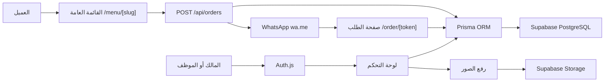
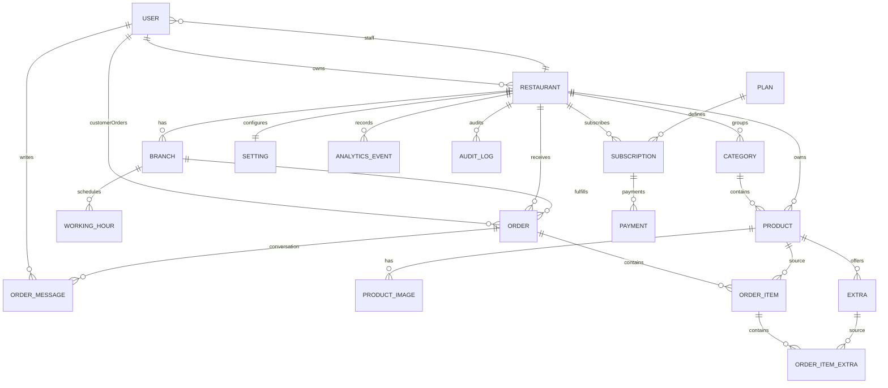

# التقرير التقني الشامل لمنصة MenuQR

## 1. الملخص التنفيذي

MenuQR منصة SaaS متعددة المطاعم تتيح لكل مطعم إنشاء قائمة رقمية عامة، إدارة الأقسام والمنتجات والصور والمخزون، استقبال الطلبات، إرسال رابط الطلب إلى واتساب، متابعة الطلب من صفحة مستقلة، والتواصل بين المطعم والعميل. المنصة ثنائية اللغة (العربية والإنجليزية)، وتستخدم Supabase PostgreSQL وSupabase Storage مع الاحتفاظ بـPrisma ORM وAuth.js.

البنية الحالية هي تطبيق Next.js واحد بنمط App Router. صفحات العرض والإدارة موجودة في `src/app`، والمكونات التفاعلية في `src/components`، ومنطق المجال والوصول إلى الخدمات في `src/lib`، ومخطط البيانات في `prisma/schema.prisma`.

## 2. التقنيات الأساسية

| الطبقة | التقنية | الاستخدام |
|---|---|---|
| الواجهة والخادم | Next.js 15 App Router | صفحات Server Components، مسارات API، Server Actions والبناء للإنتاج |
| الواجهة | React 19 + TypeScript | المكونات التفاعلية والقائمة والسلة والنوافذ |
| قاعدة البيانات | Supabase PostgreSQL | حفظ بيانات المطاعم والمنتجات والطلبات والمستخدمين والتحليلات |
| ORM | Prisma 6 | تعريف النماذج، العلاقات، الترحيلات والاستعلامات |
| المصادقة | Auth.js | تسجيل الدخول بالبريد وكلمة المرور وجلسات JWT |
| تشفير كلمات المرور | bcryptjs | تخزين `passwordHash` بتكلفة 12 |
| التخزين | Supabase Storage | شعارات المطاعم والأغلفة وصور المنتجات |
| التحقق | Zod | التحقق من التسجيل وإنشاء الطلبات وواجهات API |
| الترجمة | next-intl | العربية والإنجليزية واتجاه RTL/LTR |
| الاختبارات | Vitest | اختبارات المدخلات والأدوات واستيراد المنتجات |
| الاستيراد | xlsx | قراءة ملفات Excel وCSV الخاصة بالمنتجات |

## 3. المعمارية العامة



التطبيق متعدد المستأجرين منطقيًا؛ كل مطعم يمثل Tenant مستقلًا. بعد تسجيل الدخول تستخرج الدالة `requireTenant()` قيمة `restaurantId` من جلسة Auth.js، وتضيفها جميع صفحات الإدارة إلى شروط الاستعلام والتحديث. لا تعتمد الإدارة على معرف يرسله المتصفح وحده.

## 4. أنواع المستخدمين والصلاحيات

يحتوي تعداد `Role` على:

- `SUPER_ADMIN`: دور إداري أعلى مهيأ في البيانات، ولا توجد له حاليًا لوحة Super Admin مستقلة مكتملة.
- `OWNER`: مالك المطعم وصاحب مساحة العمل.
- `STAFF`: عضو فريق تابع للمطعم.
- `CUSTOMER`: عميل يستطيع إنشاء حساب من صفحة طلبه وربط الطلب بالحساب.

### تسجيل مطعم جديد

1. يرسل نموذج التسجيل الاسم والبريد وكلمة المرور واسم المطعم والرابط المختصر ورقم واتساب.
2. يتحقق Zod من المدخلات ويحوّل البريد والرابط ورقم واتساب إلى صيغ موحدة.
3. تنشئ Transaction مستخدمًا بدور `OWNER`.
4. تنشئ المطعم وتربطه بالمالك.
5. تحدّث المستخدم بقيمة `restaurantId` الخاصة بمساحة عمله.
6. تُخزّن كلمة المرور مشفرة ولا تُحفظ كنص صريح.

### جلسة تسجيل الدخول

Auth.js يستخدم Credentials Provider وجلسات JWT. عند نجاح تسجيل الدخول تُضاف `role` و`restaurantId` إلى التوكن ثم إلى `session.user`. صفحات لوحة التحكم ترفض المستخدم غير المسجل، كما ترفض العمل دون مساحة مطعم.

## 5. المسارات والوظائف

### المسارات العامة

| المسار | الوظيفة |
|---|---|
| `/` | الصفحة التسويقية والأسعار والمزايا |
| `/login` | تسجيل الدخول |
| `/register` | إنشاء مالك ومطعم جديد |
| `/menu/[slug]` | قائمة المطعم العامة الديناميكية |
| `/menu/[slug]/product/[productId]` | صفحة تفاصيل منتج مستقلة |
| `/order/[token]` | صفحة آمنة لمتابعة الطلب والمحادثة وتسجيل حساب العميل |
| `/robots.txt` و`/sitemap.xml` | بيانات محركات البحث |

### لوحة المطعم

| المسار | الوظيفة |
|---|---|
| `/dashboard` | مؤشرات المطعم الحقيقية، الإيرادات، أحدث الطلبات، أفضل المنتجات والعملاء |
| `/dashboard/menu` | إنشاء وتعديل وإخفاء وحذف واستيراد المنتجات |
| `/dashboard/orders` | البحث والفلترة والترتيب والصفحات وتغيير حالة الطلب وفتح رابط الطلب |
| `/dashboard/analytics` | تجميع الطلبات والإيرادات والمشاهدات والمسح من قاعدة البيانات |
| `/dashboard/profile` | عرض ملف المطعم والفروع والعنوان والمواعيد |
| `/dashboard/settings` | تعديل الهوية والصور والتواصل واللغة والعملة ومواعيد العمل واستقبال الطلبات |
| `/dashboard/team` | إنشاء أعضاء فريق بدور `STAFF` وعرضهم |

### مسارات API

| المسار | الوظيفة والحماية |
|---|---|
| `POST /api/register` | تسجيل مالك ومطعم بعد التحقق بـZod |
| `/api/auth/[...nextauth]` | معالج Auth.js |
| `POST /api/orders` | إنشاء طلب عام مع إعادة حساب السعر على الخادم |
| `POST /api/analytics` | تسجيل `MENU_VIEW` أو `QR_SCAN` لمطعم نشط |
| `POST/DELETE /api/uploads` | رفع أو حذف صورة بعد جلسة وصلاحية مطعم |
| `POST /api/products/import` | استيراد Excel/CSV بعد المصادقة وعزل المطعم |

## 6. رحلة العميل وإنشاء الطلب

1. يفتح العميل `/menu/[slug]`.
2. يحمّل الخادم المطعم النشط، الأقسام النشطة، المنتجات المتاحة، الصور والإضافات.
3. تعرض القائمة الاسم والوصف المناسبين للغة الحالية، حالة الفتح، قبول الطلبات ومدة التجهيز.
4. يبحث العميل أو يرشح حسب القسم ويضيف المنتجات إلى السلة.
5. يرسل Checkout الاسم والهاتف والعنوان والملاحظات ومعرفات المنتجات والكميات والإضافات.
6. لا يثق الخادم في الأسماء أو الأسعار القادمة من المتصفح؛ يعيد تحميل المنتجات والإضافات من PostgreSQL.
7. يتحقق الخادم من نشاط المطعم، تفعيل استقبال الطلبات، ساعات العمل، توفر المنتج والمخزون.
8. يحسب سعر الوحدة والإجمالي على الخادم.
9. داخل Transaction واحدة ينشئ الطلب وبنوده وإضافاته ويخصم المخزون للمنتجات ذات المخزون المحدد.
10. ينشئ رقمًا بصيغة `MQ-...` ورمز وصول عشوائيًا للطلب.
11. يعيد رابط واتساب يحتوي على رقم الطلب ورابط صفحة الطلب، بدل إرسال التفاصيل الطويلة.

## 7. صفحة الطلب والتواصل

كل طلب له `accessToken` فريد وإلزامي. الرابط يكون بالشكل:

```text
/order/[accessToken]
```

الرمز لا يعتمد على رقم الطلب ولا على معرف متسلسل، لذلك يصعب تخمينه. صفحة الطلب تعرض:

- المطعم ورقم الطلب والحالة الحالية.
- اسم العميل ورقم هاتفه والعنوان والملاحظات.
- البنود والكميات والإضافات والقيم والإجمالي.
- سجل محادثة مرتب زمنيًا.
- نموذج إرسال رسالة داخل الطلب.
- زر رد عبر واتساب يظهر للمطعم المسجل.
- نموذج إنشاء حساب عميل إذا لم يكن الطلب مرتبطًا بحساب.

إذا كانت جلسة المستخدم تابعة إلى نفس `restaurantId` يُصنف الرد كرسالة مطعم. إذا كان المستخدم هو العميل المرتبط أو زائرًا يحمل رابط الطلب، تُصنف الرسالة كرسالة عميل. يمتلك المطعم أيضًا رابط الصفحة من جدول الطلبات في لوحة التحكم.

## 8. حساب العميل

من صفحة الطلب يستطيع العميل إدخال البريد وكلمة مرور قوية. النظام:

1. يتحقق من البريد ومن وجود 8 أحرف وحرف إنجليزي كبير ورقم في كلمة المرور.
2. يستخدم اسم العميل ورقم هاتفه المحفوظين أصلًا في الطلب.
3. ينشئ مستخدمًا بدور `CUSTOMER` ويشفر كلمة المرور.
4. يربط `Order.customerId` بالحساب الجديد داخل Transaction.
5. يمنع إنشاء حساب جديد بالبريد الموجود مسبقًا.

رابط الطلب يظل وسيلة الوصول المباشر الحالية. نموذج البيانات يدعم تجميع طلبات العميل عبر علاقة `customerOrders`، لكن لا توجد حاليًا صفحة مستقلة مكتملة باسم “طلباتي” ضمن المسارات الموجودة.

## 9. إدارة المنتجات

صفحة المنتجات تقرأ البيانات من قاعدة البيانات مع القسم والصورة الأولى والإضافات. الوظائف الحالية:

- إضافة منتج بالعربية والإنجليزية.
- وصفان عربي وإنجليزي.
- السعر والمخزون والقسم والتوفر والتمييز.
- رفع صورة إلى bucket `product-images`.
- تعديل المنتج واستبدال صورته.
- إخفاء أو إظهار المنتج عبر `isAvailable`.
- حذف المنتج مع حذف الصور المملوكة من Supabase Storage.
- البحث في الاسمين العربي والإنجليزي.
- استيراد حتى 1000 منتج في ملف لا يتجاوز 5MB.

### استيراد Excel وCSV

الأعمدة المعتمدة:

`category_en`, `category_ar`, `name_en`, `name_ar`, `description_en`, `description_ar`, `price`, `stock`, `available`, `featured`, `image_url`.

يتم التحقق من السعر والمخزون والقيم المنطقية والرابط. إذا تطابق اسم المنتج والقسم يُحدّث المنتج، وإلا يُنشأ منتج جديد. تُحمّل الأقسام والمنتجات مسبقًا لتقليل استعلامات N+1، وتتم الكتابة داخل Transaction. توجد قوالب جاهزة في `public/templates`.

## 10. إعدادات المطعم وساعات العمل

يحفظ المطعم الهوية الأساسية والبيانات ثنائية اللغة، الهاتف، واتساب، العنوان، رابط الخريطة، فيسبوك، إنستغرام، العملة، اللغة، الشعار والغلاف.

كل مطعم يملك فروعًا، ولكل فرع سبعة سجلات `WorkingHour` مميزة بواسطة `(branchId, dayOfWeek)`. تمثل الأيام من الاثنين `0` إلى الأحد `6`. وقت الفتح والإغلاق محفوظ بصيغة نصية `HH:mm`، مع `isClosed` للإغلاق الكامل.

حساب حالة المطعم يستخدم توقيت `Africa/Cairo`. ويدعم ساعات العمل التي تتجاوز منتصف الليل؛ فإذا كان وقت الإغلاق أصغر من وقت الفتح تُعامل الفترة على أنها ممتدة لليوم التالي.

`Setting` يحفظ تفعيل الطلبات، مدة التجهيز، الضريبة، التوصيل والحد الأدنى. المستخدم حاليًا يستطيع تعديل قبول الطلبات ومدة التجهيز، بينما الحقول المالية موجودة في النموذج لتوسعات لاحقة ولم تُدمج كلها في حساب Checkout الحالي.

## 11. لوحة المعلومات والتحليلات

لوحة المعلومات تستعمل استعلامات متوازية وتجميعات PostgreSQL حقيقية:

- طلبات اليوم بحسب الحالة.
- إيراد اليوم من الطلبات المكتملة.
- إيراد الشهر والسنة.
- المنتجات النشطة والمخفية والإجمالي.
- عدد الأقسام.
- عدد مشاهدات القائمة ومسح QR.
- أحدث الطلبات.
- المنتجات الأعلى مبيعًا مع استبعاد الملغاة.
- أحدث العملاء حسب رقم الهاتف.

صفحة التحليلات تجمع الطلبات على فترات يومية وتستخدم أحداث `AnalyticsEvent` لعرض `MENU_VIEW` و`QR_SCAN`. لا توجد أرقام ثابتة في استعلامات المؤشرات؛ القيم مصدرها قاعدة البيانات.

## 12. التخزين والصور

Buckets المستخدمة:

- `restaurant-logos`
- `restaurant-covers`
- `product-images`

الصور عامة للقراءة كي تظهر في القائمة، لكن الكتابة لا تُمنح مباشرة لدور Supabase المجهول. التطبيق يرفع من الخادم باستخدام Service Role بعد فحص جلسة Auth.js والمطعم.

قيود الرفع:

- JPEG وPNG وWebP وAVIF فقط.
- حد أقصى 5MB.
- المسار يبدأ دائمًا بـ`restaurantId/` ثم UUID.
- الحذف يرفض المسارات الخارجة عن مجلد المطعم أو التي تحتوي على `..`.

## 13. تعدد اللغات

العربية والإنجليزية محملتان عبر next-intl. اختيار اللغة محفوظ في Cookie باسم `MENUQR_LOCALE`. عند الزيارة الأولى يقرأ Middleware لغة المتصفح؛ الإنجليزية تُختار إذا بدأ `Accept-Language` بـ`en` وإلا تكون العربية.

`RootLayout` يضع:

- `lang="ar"` و`dir="rtl"` للعربية.
- `lang="en"` و`dir="ltr"` للإنجليزية.

النصوص الرئيسية في `messages/ar.json` و`messages/en.json`، مع ملفات منفصلة لأدوات المنتجات وصفحة متابعة الطلب، ثم تُدمج في `src/i18n/request.ts`.

لغة رسالة واتساب الخاصة بالطلب تعتمد على `Restaurant.locale`، لا على لغة متصفح العميل، وبذلك تصل الرسالة باللغة الافتراضية للمطعم.

## 14. هيكل قاعدة البيانات

### مخطط العلاقات المختصر



### النماذج بالتفصيل

#### User

يمثل المالك أو الموظف أو العميل. أهم الحقول: `name`, `email` الفريد، `passwordHash`, `role`, `phone`, `restaurantId`. يرتبط بالمطاعم المملوكة، مطعم العمل، طلبات العميل، رسائل الطلب، رموز التحقق والاستعادة وسجلات التدقيق. يوجد index على `restaurantId`.

#### VerificationToken وPasswordResetToken

مهيآن لتدفقات التحقق واستعادة كلمة المرور. يحتوي كل سجل على token فريد ووقت انتهاء وعلاقة بالمستخدم. النماذج موجودة، لكن واجهات إرسال البريد والاستعادة ليست ضمن المسارات الحالية المكتملة.

#### Restaurant

جذر بيانات الـTenant. يحتوي الهوية ثنائية اللغة، slug فريد، بيانات التواصل، الصور، الألوان، العملة، اللغة والحالة. يرتبط بالمالك والفريق والفروع والقائمة والطلبات والاشتراكات والإعدادات والتحليلات والتدقيق.

#### Branch

يمثل فرع المطعم ويحفظ الاسم والعنوان والخريطة والهاتف والحالة. يرتبط بالمطعم وساعات العمل والطلبات.

#### WorkingHour

سجل يوم واحد لفرع: `dayOfWeek`, `opensAt`, `closesAt`, `isClosed`. القيد المركب يمنع تكرار اليوم للفرع.

#### Category

قسم قائمة تابع لمطعم: الاسم العربي والإنجليزي، الوصف، الترتيب والحالة. يوجد index مركب لتحميل أقسام المطعم بالترتيب.

#### Product

منتج تابع للمطعم والقسم. يحفظ النصوص ثنائية اللغة، السعر Decimal، التوفر، التمييز، الترتيب والمخزون الاختياري. يرتبط بالصور والإضافات وبنود الطلبات. حذف المطعم أو القسم يحذف المنتج وفق Cascade.

#### ProductImage

يحفظ رابط الصورة و`publicId` لمسار Supabase وalt والترتيب. حذف المنتج يحذف السجل، بينما أداة الحذف في التطبيق تنظف ملف Storage أيضًا.

#### Extra

إضافة اختيارية للمنتج باسم عربي/إنجليزي وسعر وتوفر. ترتبط بنسخ الإضافات المحفوظة داخل الطلبات.

#### Order

رأس الطلب ويحفظ رقمًا فريدًا، بيانات العميل وقت الطلب، المبالغ، الحالة، access token فريدًا، المطعم والفرع الاختياري وحساب العميل الاختياري. يرتبط بالبنود والمحادثة. توجد indexes على `(restaurantId, createdAt)` و`(customerId, createdAt)` إضافة إلى index حالة الطلب المحسن في SQL.

#### OrderItem

نسخة تاريخية من اسم المنتج وسعر الوحدة والكمية والملاحظات. يحتفظ بـ`productId` اختياريًا؛ إذا حُذف المنتج يصبح المرجع null، بينما يظل اسم المنتج والسعر داخل الطلب محفوظين.

#### OrderItemExtra

نسخة تاريخية من اسم الإضافة وسعرها. المرجع إلى Extra اختياري للسبب نفسه، لكن قيمة الطلب الأصلية تظل محفوظة.

#### OrderMessage

رسالة داخل محادثة الطلب، تحتوي النص ودور المرسل والطلب والمستخدم الاختياري والتاريخ. يوجد index على `(orderId, createdAt)` لتحميل المحادثة زمنيًا.

#### Plan

تعريف خطة الاشتراك: السعر والدورية وحدود المنتجات والفروع والفريق والتحليلات والدومين. النموذج مهيأ للجانب التجاري.

#### Subscription

اشتراك مطعم في خطة مع الحالة وتواريخ البداية والنهاية والمدفوعات.

#### Payment

دفعة لاشتراك، تشمل المبلغ والعملة والحالة والمزود والمرجع الفريد. البنية موجودة ولا يوجد حاليًا تكامل بوابة دفع مكتمل ضمن المسارات.

#### Setting

سجل واحد لكل مطعم بسبب `restaurantId @unique`. يحفظ إعدادات الطلب والتجهيز والرسوم والضريبة والحد الأدنى.

#### AnalyticsEvent

حدث تحليلي عام يحتوي النوع والمنتج والبيانات الإضافية وIP hash الاختياري والمطعم والتاريخ. index مركب يدعم التجميع حسب المطعم والنوع والتاريخ.

#### AuditLog

بنية لتسجيل الفعل والكيان والمعرف والـmetadata والعنوان والمستخدم والمطعم. يوجد index للمطعم والتاريخ. النموذج مهيأ لكن العمليات الحالية لا تكتب AuditLog بصورة شاملة بعد.

## 15. الحذف والعلاقات المرجعية

- حذف مطعم يحذف الفروع والأقسام والمنتجات والطلبات والإعدادات والتحليلات والاشتراكات التابعة باستخدام Cascade.
- حذف منتج يحذف صوره وإضافاته، ويحوّل مرجعه داخل OrderItem إلى null حفاظًا على تاريخ الطلب.
- حذف Extra يحوّل مرجعه داخل OrderItemExtra إلى null مع بقاء الاسم والسعر التاريخيين.
- حذف مستخدم عميل يحوّل `Order.customerId` إلى null ولا يحذف الطلب.
- حذف طلب يحذف بنوده وإضافاتها ورسائله.
- حذف مستخدم كتب رسالة أو AuditLog يحوّل `userId` إلى null.

## 16. الفهارس والأداء

توجد فهارس على أكثر مسارات القراءة تكرارًا:

- المطعم والحالة والتاريخ للطلبات.
- المطعم والتوفر والترتيب للمنتجات.
- القسم والترتيب للمنتجات.
- المنتج والترتيب للصور.
- المنتج والتوفر للإضافات.
- المطعم والترتيب للأقسام.
- المطعم والنوع والتاريخ للتحليلات.
- الطلب والتاريخ للرسائل.
- المطعم والحالة للاشتراكات.

اللوحة تستخدم `Promise.all`, `groupBy`, `aggregate`, `_count` و`_sum` لتقليل الرحلات إلى قاعدة البيانات. صفحات القوائم تستخدم pagination في الطلبات وحدود تحميل في المنتجات. إنشاء الطلب يستخدم Transaction لضمان اتساق الطلب وخصم المخزون.

## 17. Supabase والاتصالات

Prisma datasource يستخدم رابطين:

- `DATABASE_URL`: اتصال Runtime عبر Supabase Pooler، مناسب للوظائف Serverless.
- `DIRECT_URL`: اتصال مباشر أو Session Pooler للترحيلات.

المتغيرات الأخرى:

- `NEXT_PUBLIC_SUPABASE_URL`
- `NEXT_PUBLIC_SUPABASE_ANON_KEY`
- `SUPABASE_SERVICE_ROLE_KEY` للخادم فقط
- `AUTH_SECRET`
- `NEXT_PUBLIC_APP_URL` لبناء روابط الطلبات العامة الصحيحة

يجب ضبط `NEXT_PUBLIC_APP_URL` على دومين Vercel النهائي؛ وإذا لم يوجد، يستخدم API أصل الطلب الحالي عند إنشاء رابط المتابعة.

## 18. Row Level Security

ترحيل Supabase يفعّل RLS على الجداول الأساسية ويضيف سياسات قراءة عامة للمطاعم النشطة والأقسام والمنتجات والصور والإضافات المتاحة، وسياسات Tenant نموذجية تعتمد على `app.current_restaurant_id`.

التطبيق نفسه يستخدم Prisma باتصال مالك قاعدة البيانات الذي يتجاوز RLS عادة، لذلك خط الدفاع الفعلي داخل التطبيق هو شروط `restaurantId` والتحقق من Auth.js. Service Role مستخدم فقط على الخادم للتخزين.

ملاحظة حالية: جدول `OrderMessage` أضيف بعد ترحيل RLS الأساسي ولم يُفعّل له RLS مستقل في الترحيلات الحالية. الوصول إليه يتم عبر Prisma وصفحة الطلب ذات الرمز الآمن. إذا تقرر كشفه مستقبلًا عبر Supabase REST أو عميل anon فيجب إضافة RLS وسياسات صريحة قبل ذلك.

## 19. الأمان الحالي

- كلمات المرور مشفرة بـbcrypt.
- JWT موقعة بواسطة `AUTH_SECRET`.
- التحقق من Tenant داخل عمليات الإدارة.
- الأسعار والمخزون يعاد التحقق منهما على الخادم.
- رابط الطلب يستخدم token عشوائيًا وفريدًا.
- رفع الصور محدود بالنوع والحجم ومسار المطعم.
- Middleware يضيف `nosniff`, `DENY`, Referrer Policy وPermissions Policy.
- مفاتيح Service Role لا تُرسل إلى المتصفح.

نقاط تقوية موصى بها للإنتاج عالي الحمل:

- Rate limiting على إنشاء الطلبات، التحليلات، الرسائل والتسجيل.
- تحقق ملكية الهاتف للعميل عبر OTP قبل تجميع طلبات متعددة في حساب واحد.
- CSRF/abuse monitoring لنماذج الرسائل العامة ذات الرابط.
- كتابة AuditLog للعمليات الحساسة.
- إضافة RLS للجداول الجديدة إذا استُخدم PostgREST مباشرة.
- تفعيل التحقق من البريد واستعادة كلمة المرور فعليًا.

## 20. الترحيلات الحالية

1. `20260721000100_init`: إنشاء المخطط الأساسي.
2. `20260721000200_supabase_rls_indexes`: فهارس Supabase وRLS وسياسات نموذجية.
3. `20260721000300_profile_stock`: بيانات ملف المطعم والمخزون.
4. `20260721000400_ordering_hours`: إعدادات استقبال الطلب ومدة التجهيز والمواعيد.
5. `20260721000500_order_tracking`: حساب العميل ورابط الطلب والمحادثة.
6. `20260721000600_backfill_order_links`: إنشاء روابط للطلبات القديمة وجعل token إلزاميًا.

## 21. التشغيل والنشر

التشغيل المحلي:

```bash
npm install
npm run db:generate
npm run db:deploy
npm run dev
```

فحوص التسليم:

```bash
npm run lint
npm run test
npm run build
```

في Supabase يجب تشغيل `supabase/storage.sql` لإنشاء buckets وسياسة القراءة. في Vercel يجب إضافة متغيرات البيئة نفسها، واستخدام Pooler في `DATABASE_URL`، والرابط المباشر/Session في `DIRECT_URL`، ثم تطبيق `db:deploy` عند كل إصدار يتضمن Migration.

## 22. خلاصة حالة النظام

المنصة الحالية تغطي دورة المطعم الأساسية: التسجيل، إعداد الهوية والمواعيد، إدارة الفريق، بناء القائمة، إدارة الصور والمخزون، استقبال طلب محسوب على الخادم، إرسال رابط واتساب، متابعة الطلب والتواصل، إحصاءات حقيقية، وتسجيل حساب العميل من الطلب.

نماذج الخطط والاشتراكات والمدفوعات والتحقق من البريد واستعادة كلمة المرور وسجل التدقيق موجودة كأساس بيانات، لكنها تحتاج تكاملات وواجهات تشغيلية إضافية إذا أريد تحويلها إلى وحدات تجارية مكتملة. كذلك يدعم نموذج العميل ربط الطلبات، بينما صفحة موحدة لعرض “طلباتي” ليست موجودة حاليًا.
