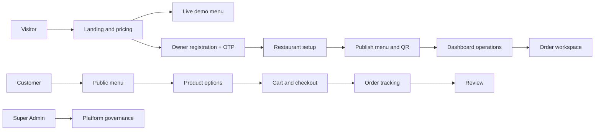
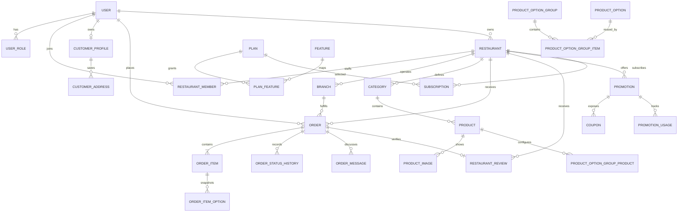

# MenuQR Frontend Design Documentation

> Source-of-truth UX inventory for a future frontend redesign  
> Generated from the current Next.js application and Prisma schema on 3 August 2026.  
> Scope: existing behavior, information architecture, screens, forms, data dependencies, and design risks. This document does not propose backend changes and no application code was modified.

## 1. Project overview

MenuQR is a bilingual Arabic/English restaurant SaaS platform. A restaurant can publish a QR-accessible menu, accept delivery/pickup/dine-in orders, operate multiple branches, manage products and promotions, communicate over WhatsApp, collect reviews, and inspect analytics. Customers can order as guests or maintain an account. A platform operator manages tenants, users, plans, configuration, and audit data.

### Product surfaces

| Surface | Primary audience | Purpose |
|---|---|---|
| Marketing website | Visitor | Explain MenuQR, show pricing and live demos, convert to registration |
| Public restaurant menu | Guest/customer | Discover a restaurant, browse products, configure a cart, checkout, review and track an order |
| Customer account | Customer | Manage profile, addresses, orders and favorites |
| Restaurant dashboard | Owner/staff | Operate menu, orders, branches, customers, delivery, promotions, reviews and settings |
| Super Admin console | Platform operator | Manage all tenants, users, orders, plans and dynamic platform configuration |

### Technical architecture relevant to design

- Next.js 15 App Router with React Server Components by default and client components for interaction-heavy experiences.
- Auth.js credentials authentication, with WhatsApp OTP for registration/password recovery.
- Prisma/PostgreSQL (Supabase) as the transactional source of truth.
- `next-intl` for Arabic and English; Arabic is the default and document direction changes between RTL/LTR.
- Tailwind CSS plus substantial global/module-like CSS class systems.
- Supabase Storage for uploaded images; Leaflet/OpenStreetMap for maps; Meta WhatsApp Cloud API for transactional messages.
- Public menu caching is short-lived; mutations use server actions or route handlers.
- Plan capabilities are feature-based rather than UI-only plan-name checks.

### Main workflows



## 2. User roles and permissions

The database role enum contains `SUPER_ADMIN`, `RESTAURANT_OWNER`, `STAFF`, and `CUSTOMER`. A user can hold multiple roles and restaurant membership is a separate relationship, allowing an owner to also act as a customer. Permissions are checked server-side.

| Role/audience | Permissions and responsibilities | Main accessible areas |
|---|---|---|
| Super Admin | Platform-wide read/write access; manage users, restaurants, orders, plans, features, settings, flags and audit records | `/super-admin/**` |
| Restaurant Owner | Own tenant; configure restaurant and branches; manage team, catalog, orders, drivers, customers, promotions, reviews, domain and subscription | `/dashboard/**`; authenticated staff view of `/order/[token]` |
| Restaurant Staff | Tenant-scoped operational access through `RestaurantMember`; exact operations depend on server authorization but primarily order/catalog work | Authorized dashboard pages and staff order workspace |
| Customer | Own profile, addresses, favorites and order history; can place and review orders | `/account/**`, public menu/checkout/tracking/review |
| Guest visitor | No stored role; can browse, order without an account, track with a secure public token, and submit permitted reviews | `/`, `/menu/**`, `/order/[token]`, review routes |
| Demo visitor | Guest in a read-only demo tenant; ordering is simulated and changes are not persisted | Demo links resolved through public menu components |
| Delivery driver | Operational record, not currently an authenticated user role; owner assigns a driver and exposes navigation actions | Managed at `/dashboard/drivers`; no dedicated driver portal |

Tenant access must never be inferred from a client-visible `restaurantId`. The current authorization model derives restaurant access from ownership/membership on the server. Designers should distinguish role availability from subscription feature availability: a permitted owner may still see a locked capability because of the active plan.

## 3. Page inventory

### 3.1 Marketing, authentication, and system pages

| Route | Purpose / target user | Required data and key components | Actions, navigation, and integrations |
|---|---|---|---|
| `/` | Landing page for visitors | Dynamic homepage settings, plans, launch promotion and demo restaurants; top banner, hero, feature/pricing/demo cards, language switcher | Open demos, pricing/login/register. Primarily server data; no direct client API |
| `/login` | Restaurant owner/staff login | `AuthForm`, email/password | Auth.js sign-in; forgot password; register; dashboard redirect |
| `/customer/login` | Customer-specific login entry | Same `AuthForm` with customer copy and destination | Auth.js sign-in; account redirect; forgot password/register |
| `/register` | Restaurant owner onboarding | `AuthForm`, Turnstile, restaurant identity and account details | `POST /api/whatsapp/send-otp`, `verify-otp`, then `POST /api/register`; dashboard on success |
| `/forgot-password` | Password recovery for all account types | `PasswordResetForm`, phone, OTP, new password | WhatsApp send/verify OTP; `POST /api/password/reset`; login on success |
| `/auth/continue` | Resolve post-login destination by roles | Auth session and role data | Redirect to super admin, restaurant dashboard, customer account or login |
| Global `not-found` | Friendly 404 | Localized copy and recovery links | Return home/login as relevant |
| Global `error` | Runtime error boundary | Error digest and retry affordance | Retry or navigate safely |

### 3.2 Public restaurant and customer ordering

| Route | Purpose / target user | Required data and key components | Actions, navigation, and integrations |
|---|---|---|---|
| `/menu/[slug]` | Main restaurant menu | Restaurant profile, hours/status, branch list, categories/products/options, promotions, ratings, QR, feature entitlements; `PublicMenuPage`, `PublicBranchDialog`, `RestaurantQr`, `MenuClient` | Search/filter categories, grid/list, product sheet, cart, coupon and checkout. `POST /api/analytics`, `/api/promotions/calculate`, `/api/orders` |
| `/menu/[slug]/[branchSlug]` | Branch-specific menu | Same menu dataset plus selected branch contact/address/hours and branch catalog scope | Switch branch, order from selected branch; same menu APIs |
| `/domain/[hostname]` | Custom-domain menu resolver | Verified `CustomDomain`, restaurant and optional branch | Renders the same public menu rather than a separate UI |
| `/menu/[slug]/product/[productId]` | Shareable/SEO product detail | Product, category, images, option groups and recommendations; `ProductOrderOptions` | Select multiple optional extras, quantity and order; returns configured item to menu/cart |
| `/menu/[slug]/reviews` | Public reviews list | Aggregate rating, distribution, published reviews, owner replies/images, pagination | Search/sort/filter latest/highest/lowest/with images/topic; navigate to review form |
| `/r/[slug]/review` | Restaurant review form | Restaurant review settings and optional order token; `ReviewForm` | Score overall/food/delivery/packaging/staff, comment and images; server action/upload |
| `/menu/review/[token]` | Compatibility review link | Secure order public token | Redirects to canonical restaurant review form with order context |
| `/order/[token]` | Public tracking and authenticated restaurant order workspace | Order, restaurant, branch, customer, items/options, totals, location, history, messages, driver and review | Customer tracks/messages/reorders/reviews; staff updates status/items/driver/messages and prints. Server actions plus WhatsApp services |

There is no standalone cart or checkout route. Both are interactive states inside `MenuClient` on the public menu. Product configuration usually opens a bottom sheet, while the dedicated product route remains useful for deep links.

### 3.3 Customer account

All pages use the customer shell/drawer and require a customer-capable authenticated user.

| Route | Purpose | Data / components | Main actions |
|---|---|---|---|
| `/account` | Account overview | Profile summary, order/favorite/address counts | Navigate to account modules |
| `/account/orders` | Personal order history | Paginated customer orders and statuses | Open public order tracking/detail, reorder |
| `/account/favorites/restaurants` | Saved restaurants | Restaurant cards | Open menu, remove favorite through server action |
| `/account/favorites/products` | Saved products | Product and restaurant cards | Open product/menu, remove favorite |
| `/account/addresses` | Saved delivery locations | Address cards, `LocationPicker` | Add, select default and delete addresses through server actions |
| `/account/profile` | Identity, language and password | Profile and password forms | Update name/phone/language; change password; show inline result |

### 3.4 Restaurant dashboard

The dashboard shell contains a desktop sidebar and a mobile drawer, language switcher, notification center, restaurant context and sign-out.

| Route | Purpose | Required data / components | Main actions and integrations |
|---|---|---|---|
| `/dashboard` | Operational overview | Restaurant/logo, plan, real KPIs, setup checklist, recent orders, top products/customers; disclosures and QR card | Open work areas, dismiss setup, QR download/copy/print; direct Prisma/server actions |
| `/dashboard/menu` | Product and category operations | Paginated products/categories/options; product wizard, option editor, import dialog, action buttons | Create/edit/delete/duplicate, availability, featured, move, price, CSV/XLSX import; `/api/products/import`; feature gates |
| `/dashboard/menu/import-pdf` | AI PDF import | `PdfMenuImporter`; entitlement, upload/analyzed editable menu | `/api/products/import-pdf/upload-url`, `/analyze`, `/save` |
| `/dashboard/options` | Legacy reusable-options address | No independent UI | Redirects to `/dashboard/menu`; keep only as migration/compatibility route |
| `/dashboard/orders` | Searchable order queue | Paginated tenant orders, status/search filters, responsive rows/cards | Open order, update status, send review request; server actions |
| `/dashboard/customers` | Customer directory derived from orders | Aggregated paginated customers and recent activity | Search, view associated activity/contact customer |
| `/dashboard/analytics` | Restaurant performance | 30-day views, QR scans, orders, revenue, product/fulfilment/driver/promotion insights; basic bars | Change range where available; feature-gated basic/advanced data |
| `/dashboard/branches` | Branch list | Branch plan limit and cards | Open/create/delete branches; `GET/POST /api/branches`, branch delete API |
| `/dashboard/branches/new` | Add branch wizard modal/page | `BranchForm`, map, structured address and hours | `POST /api/branches`; return to branch list |
| `/dashboard/branches/[id]` | Edit a branch | Existing branch, working hours; same wizard | `PUT/DELETE /api/branches/[id]` |
| `/dashboard/drivers` | Delivery-driver management | Drivers and assigned order counts | Add/edit driver, update availability, delete; server actions |
| `/dashboard/promotions` | Promotions list and performance | Promotion cards/status, analytics/usage | Filter; activate/pause/archive/delete/duplicate; promotion APIs |
| `/dashboard/promotions/new` | Create promotion wizard | `PromotionForm`, catalog/branch targets | Seven-step explicit save; `POST /api/promotions` |
| `/dashboard/promotions/[id]` | Edit promotion | Existing rules, targets, usage | Explicit update; `PATCH /api/promotions/[id]` |
| `/dashboard/reviews` | Review analytics and moderation | Scores, period counts, filters, latest reviews; moderation cards | Publish/hide/report and public reply; server actions; review feature gate |
| `/dashboard/team` | Restaurant member management | Current members and plan member limit | Invite/create staff with temporary password, remove member; server actions |
| `/dashboard/subscription` | Plan and entitlement management | Current subscription, plan comparison, launch offer, renewal/expiry | Upgrade/downgrade plan through server action; no external checkout UI yet |
| `/dashboard/domain` | Custom-domain setup | Current verified/pending domain and DNS guidance | Save, refresh verification, remove; `RemoveDomainButton`; feature gate |
| `/dashboard/security` | Owner password settings | Current/new/confirm password | Change password via server action |
| `/dashboard/settings` | Restaurant configuration hub | Restaurant details, media, ordering, charges, reviews, notifications, location, hours and QR; wizard/modal/map | Save settings and uploads; `POST/DELETE /api/uploads`; browser notification preferences |

`/dashboard/profile` intentionally does not exist. Restaurant profile configuration has been consolidated into settings.

### 3.5 Super Admin console

| Route | Purpose | Required data / components | Main actions |
|---|---|---|---|
| `/super-admin` | Platform command center | Global KPIs, growth/status summaries and recent records | Navigate to governance modules |
| `/super-admin/users` | User directory | Search/filter/paginated users, roles and tenant relations | Open account support detail |
| `/super-admin/users/[id]` | User support and administration | User identity, roles, status, memberships/subscriptions/orders/audit | Edit safe profile fields, roles/language/active state, issue temporary password |
| `/super-admin/restaurants` | Tenant directory | Search/status restaurants, owner, branches, subscription and order metrics | Open restaurant administration |
| `/super-admin/restaurants/[id]` | Restaurant support and administration | Restaurant profile, branches, owner, subscription, orders/features | Edit account settings and subscription, inspect branches and diagnostics |
| `/super-admin/orders` | Cross-platform order search | Restaurant/customer/status/date filters and pagination | Open any order safely |
| `/super-admin/orders/[id]` | Platform order intervention | Full order/customer/address/status/restaurant data | Correct selected fields/status with audit log |
| `/super-admin/configuration` | Dynamic configuration engine | Settings, feature flags and homepage sections | Edit typed/JSON values, enable flags and homepage content; cache invalidation via server action |
| `/super-admin/plans` | Plan/feature administration | Plans, feature catalog, mappings, launch promotion | Edit price/limits/features and launch offer behavior |
| `/super-admin/audit-logs` | Trace privileged changes | Actor/action/entity metadata and pagination | Search/filter and inspect audit entries |

## 4. Component library inventory

### 4.1 Formal reusable components

| Component | Responsibility and usage |
|---|---|
| `AccordionSection` | Collapsible content block used to reduce long dashboard/page scroll; multiple sections can remain open |
| `DashboardDisclosure` / record disclosures | Collapsible dashboard sections and individual records on compact screens |
| `FormWizard` | Step indicator, previous/next/finish orchestration for long forms |
| `DashboardFormModal` | Closeable/minimizable responsive modal frame for dashboard forms |
| `DashboardSidebar` / `DashboardWrapper` | Feature-aware restaurant navigation, desktop shell and mobile drawer |
| `CustomerShellWrapper` | Customer-account desktop sidebar/mobile drawer shell |
| `LanguageSwitcher` | Persists language cookie and reloads localized UI |
| `RestaurantNotificationCenter` | Unread count/popover, mark-as-read; deliberately no polling |
| `ToastProvider` | Global transient success feedback from query state or custom events |
| `MenuClient` | Public menu application: navigation, product sheet, cart, checkout and order submission |
| `PublicMenuPage` | Server-rendered composition for hero, restaurant facts, rating, promotions, branches, QR and menu |
| `PublicBranchDialog` | Compact branch trigger and responsive branch-selection modal |
| `ProductOrderOptions` / `ProductOptionsEditor` | Customer option selection and owner reusable option-group authoring |
| `FavoriteButtons` | Restaurant/product favorite server-action controls |
| `RestaurantQr` | Browser-generated QR with PNG/SVG/copy/print controls |
| `LocationPicker`, `RestaurantLocationFields`, `OrderMapWrapper` | Lazy Leaflet map, GPS, accuracy circle, draggable marker, reverse geocoding and stored coordinates |
| `OrderLocationActions` / `OrderWorkspaceActions` | Location modal, Google Maps link, copy/call/WhatsApp and invoice/kitchen print actions |
| `AuthForm` / `PasswordResetForm` | Login, registration OTP and password-recovery flows |
| `TurnstileWidget` | Lazy Cloudflare challenge for registration/order anti-spam |
| `BranchForm` | Four-step branch editor including structured location and weekly hours |
| `PromotionForm` | Seven-step promotion rule editor |
| `ReviewForm` | Accessible multi-dimension star scoring, comment and image upload |
| `ProductImportDialog` / `PdfMenuImporter` | Spreadsheet requirements/import report and AI PDF upload/review/import |
| Confirmation/destructive helpers | `ConfirmSubmitButton`, `DeleteProductButton`, `BranchDeleteButton`, `RemoveDomainButton` |
| `CloseDetailsButton` | Close/minimize control for large details surfaces |
| `NotificationPreferences` | Browser/sound preference stored locally in the browser |

### 4.2 CSS-based primitives (should become explicit design-system components)

The application repeatedly uses class conventions rather than typed reusable primitives: primary/secondary/danger buttons, dashboard cards, management cards, stats, record lists, tables, search bars, pagination, status pills, badges, friendly empty states, modal surfaces and form fields. A redesign should formalize these into Button, IconButton, Card, StatCard, Badge, Field, Select, Textarea, Dialog/Sheet, DataTable, MobileRecordCard, EmptyState, Skeleton, Pagination, SearchField, FilterBar, Alert and Toast components.

### 4.3 Component states designers must specify

Every primitive needs default, hover, focus-visible, active, disabled, loading, success and error states. Data components additionally need empty, partial, stale/cached and permission-locked states. Modal/sheet components need mobile, tablet and desktop layouts, focus behavior and destructive-action confirmation patterns.

## 5. Forms inventory

| Form | Fields and validation | Submission / success / failure |
|---|---|---|
| Restaurant registration | Name 2–80; email; password min 8 with uppercase and number; restaurant name 2–100; normalized unique slug 3–60; WhatsApp 8–15 digits; language; Turnstile; OTP | Send and verify WhatsApp OTP, then `/api/register`; create user/restaurant/subscription and redirect. Inline/localized validation and API error |
| Login | Email and password | Auth.js credentials; role-aware redirect; invalid credentials inline |
| Forgot/reset password | Phone; 6-digit OTP; new/confirm password | Send/verify WhatsApp OTP then `/api/password/reset`; login link on success |
| Customer profile | Name, phone, language | Server action; refresh profile and localized result |
| Change password | Current, new, confirm | Server action; field/auth errors, success confirmation |
| Customer address | Title min 2, address min 5, optional latitude/longitude and default flag | Server action; add/default/delete and refresh list |
| Checkout | Customer name 2–80, phone 8–20, fulfilment type; delivery address required for delivery; optional coordinates and structured address; building/floor/apartment/landmark/delivery notes currently required for delivery; order notes max 500; payment method; coupon; optional account email/password | `/api/promotions/calculate` then `/api/orders`; server recalculates totals and availability; success opens secure tracking/WhatsApp, errors remain in checkout |
| Restaurant settings | Bilingual name/description, logo/cover, phone/WhatsApp, locale/currency, ordering and fulfilment toggles, preparation time, service/delivery/tax type and value, review policies, notifications, full structured address/map, social/contact/hours | Server actions/uploads; saved banner/toast; feature-locked sections where needed |
| Branch create/edit | Name, URL slug, active, phone/email/WhatsApp inheritance, governorate/city/district/area/street/address, country/postal/state, coordinates, map URL and seven-day hours | `/api/branches` or `/api/branches/[id]`; returns to list on success; plan/slug/validation errors |
| Product create/edit | Bilingual name, category or new category, image, price/discount when supported, availability, stock, featured, bilingual description, ingredients/calories/prep time, option groups, related/recommended products | Server action; refresh catalog; localized validation, upload and uniqueness errors |
| Product quick actions | Availability, duplicate, featured, category, price and delete | Server actions; optimistic/no-reload intent; confirmation for destructive delete |
| CSV/XLSX import | File plus documented columns; name/category/price required; optional direct HTTPS image meeting type/size rules | `/api/products/import`; row-level created/updated/skipped report |
| PDF AI import | PDF only, max 20 MB; editable categories/items/name/description/price/currency | Upload URL → analyze → review → save endpoints; handles empty/corrupt/quota/AI JSON errors |
| Product option groups | Bilingual group, required flag, min/max; create new or reuse option; bilingual label and price modifier | Nested in product form; save with product in a transaction |
| Promotion wizard | Bilingual title/description; type/value or X/Y; constraints; target products/categories/branches; schedule dates, optional times and weekdays; usage/audience/coupon/stacking/priority; final status | Promotion REST APIs; explicit final Save only; field-specific errors and status actions in list |
| Driver | Name, phone, WhatsApp, vehicle/status/photo | Server action; refresh driver cards and validation |
| Team member | Name, email, temporary password and membership role | Server action; enforces feature/member limit; displays credentials safely once |
| Custom domain | Hostname | Save/verify/refresh/remove; DNS instructions and verification status |
| Subscription | Target plan | Server action immediately changes local subscription; success/failure banner |
| Public review | Overall, food, delivery, packaging, staff scores; optional comment max 1000; up to three images; optional anonymous identity per settings | Server action/storage; thank-you state; rate/duplicate/order-policy errors |
| Review moderation/reply | Publish/hide/report status; one public reply | Server actions; card updates or generic failure banner |
| Order operations | Status, item quantity/remove/replace/duplicate, option edits, order notes, complimentary product, driver assignment, internal/customer message and optional customer account creation | Server actions and WhatsApp notifications; order creation/status must remain successful if messaging fails |
| Super Admin user | Name, phone, language, active state, roles, optional temporary password | Audited server action; return to detail with result |
| Super Admin restaurant | Profile/support fields, subscription plan/status/dates, branch corrections | Audited server actions; tenant diagnostics remain visible |
| Super Admin order | Customer/contact/address and controlled status correction | Audited server action; preserves order financial history |
| Dynamic configuration | Setting key/type/value, feature flag and homepage-section fields/JSON | Server action, validation, audit and cache invalidation |
| Plan administration | Plan identity, localized text, price/currency/interval, limits, active/public/order; feature mapping/values; launch dates/plan/status | Server action; updated pricing/entitlements become data-driven |

## 6. Frontend data model

### 6.1 Relationship map



### 6.2 Entity glossary

| Entity group | Meaning in the frontend |
|---|---|
| User, UserRole, RestaurantMember | One identity with platform roles and tenant-specific membership; drives navigation and permissions |
| CustomerProfile, CustomerAddress, favorites | Customer preferences, saved delivery points, favorite restaurants/products |
| Restaurant, Branch, WorkingHour | Brand/profile plus one or more operating locations, structured address, coordinates, contact and schedule |
| Category, Product, ProductImage | Ordered menu hierarchy and product media, price, visibility, stock and featured state |
| ProductOptionGroup, ProductOption and mapping entities | Reusable add-ons grouped per product with required/optional and min/max rules |
| Order, OrderItem, OrderItemOption/Extra | Server-priced purchase snapshot, fulfilment/contact/location, selected options and totals |
| OrderStatusHistory, OrderActionLog, OrderMessage | Customer/staff timeline, audit trail and order conversation |
| DeliveryDriver | Restaurant delivery resource and current availability |
| Promotion, Coupon, target mappings, usage/order links | Automatic/coupon offers, eligibility, schedule, limits and applied-discount trace |
| RestaurantReview/Image | Moderated multi-score review, verified-order badge, images and owner reply |
| RestaurantNotification/Read | Lightweight per-restaurant events and per-user read state |
| Plan, Feature, PlanFeature, Subscription, Payment, LaunchPromotion | Commercial entitlement and billing domain; UI must check capabilities, not plan names |
| PlatformSetting, FeatureFlag, HomepageSection | Dynamic platform content/configuration controlled by Super Admin |
| CustomDomain | Verified hostname mapped to a restaurant/branch |
| WhatsAppOtp, WhatsAppMessage, verification/reset tokens | Authentication and transactional communication state, not normally exposed as screens |
| AnalyticsEvent, AuditLog | Public-menu events and privileged platform actions |

Key status vocabularies: orders move through New, Confirmed, Preparing, Ready, Assigned, Out for Delivery, Delivered/Completed, Cancelled/Rejected/Failed Delivery. Products are Available, Temporarily Unavailable or Hidden. Reviews are Pending, Published or Hidden. Subscriptions are Trialing, Active, Past Due or Cancelled. Promotions are Draft, Active, Paused or Archived.

## 7. User flows

### 7.1 Customer browsing and ordering

```text
Landing/demo/QR/custom domain
→ restaurant hero and operating status
→ choose branch when applicable
→ horizontally browse categories or search
→ open product bottom sheet/deep-link detail
→ choose optional option groups, quantity and notes
→ add to cart
→ open sticky cart; edit quantity/options/notes or remove
→ choose delivery/pickup/dine-in
→ enter required address details; optionally select precise map point
→ review itemized subtotal, discounts, fees, tax and grand total
→ complete Turnstile and confirm
→ server validates/reprices and creates order
→ open secure /order/{publicToken}
→ receive status updates/messages and optionally create customer account
→ submit review after completion
```

### 7.2 Restaurant onboarding and catalog publication

```text
Register owner and restaurant identity
→ WhatsApp OTP verification
→ dashboard setup checklist
→ restaurant information/logo/contact/location
→ working hours and fulfilment settings
→ create branch(es) if required
→ create categories/products/options or import spreadsheet/PDF
→ review public menu
→ download/print QR or connect custom domain
```

### 7.3 Restaurant order operation

```text
New-order dashboard/WhatsApp notification
→ order list/search/filter
→ authenticated order workspace
→ confirm or reject
→ edit only through audited operations when necessary
→ preparing → ready
→ assign driver → out for delivery (or pickup/dine-in path)
→ delivered/completed
→ send review request
→ inspect messages, history, invoice/kitchen ticket
```

### 7.4 Super Admin support

```text
Super Admin dashboard
→ search user, restaurant or order
→ inspect relationships and current subscription
→ make constrained correction / change active state / issue temporary password
→ save
→ audit log records actor, entity and action
```

### 7.5 Subscription and feature access

```text
Pricing or dashboard subscription
→ compare data-driven plans/features
→ see launch promotion eligibility
→ choose upgrade/downgrade
→ update subscription
→ navigation and APIs reevaluate feature keys and numeric limits
→ locked capability shows upgrade explanation instead of failing silently
```

## 8. Navigation map / sitemap

```text
MenuQR
├── Public
│   ├── Landing / demos / pricing                    /
│   ├── Restaurant menu                             /menu/{slug}
│   │   ├── Branch menu                             /menu/{slug}/{branchSlug}
│   │   ├── Product detail                          /menu/{slug}/product/{productId}
│   │   └── Reviews                                 /menu/{slug}/reviews
│   ├── Custom domain menu                          /domain/{hostname}
│   ├── Review form                                 /r/{slug}/review
│   └── Order tracking                              /order/{publicToken}
├── Authentication
│   ├── Restaurant login                            /login
│   ├── Customer login                              /customer/login
│   ├── Registration                                /register
│   ├── Password recovery                           /forgot-password
│   └── Role router                                 /auth/continue
├── Customer account                                /account
│   ├── Orders                                      /account/orders
│   ├── Favorite restaurants                        /account/favorites/restaurants
│   ├── Favorite products                           /account/favorites/products
│   ├── Addresses                                   /account/addresses
│   └── Profile                                     /account/profile
├── Restaurant dashboard                            /dashboard
│   ├── Products/imports                            /dashboard/menu/**
│   ├── Orders                                      /dashboard/orders
│   ├── Customers                                   /dashboard/customers
│   ├── Analytics                                   /dashboard/analytics
│   ├── Branches                                    /dashboard/branches/**
│   ├── Drivers                                     /dashboard/drivers
│   ├── Promotions                                  /dashboard/promotions/**
│   ├── Reviews                                     /dashboard/reviews
│   ├── Team                                        /dashboard/team
│   ├── Subscription                                /dashboard/subscription
│   ├── Domain                                      /dashboard/domain
│   ├── Security                                    /dashboard/security
│   └── Restaurant settings                         /dashboard/settings
└── Super Admin                                     /super-admin
    ├── Users                                       /super-admin/users/**
    ├── Restaurants                                 /super-admin/restaurants/**
    ├── Orders                                      /super-admin/orders/**
    ├── Plans                                       /super-admin/plans
    ├── Dynamic configuration                       /super-admin/configuration
    └── Audit logs                                  /super-admin/audit-logs
```

Primary navigation should expose only role- and feature-appropriate destinations. Cross-surface links should be explicit: public menu → customer login/account; dashboard → public-menu preview; order tracking → customer account/review; subscription locks → plan comparison; Super Admin details → related user/restaurant/order.

## 9. Current UI and UX problems

These findings are based on source structure and current interaction patterns, not a visual preference exercise.

### Critical

1. **Overloaded order screen.** `/order/[token]` serves both customer tracking and restaurant operations. Its large action set, financial summary, item editing, location, timeline, messages, driver and review functions compete for attention. The two audiences need distinct compositions even if the route/data remain shared.
2. **Cart and checkout are hidden application states.** They have no canonical routes, so browser back, refresh, support links and recovery from validation errors are harder to communicate.
3. **Very large components.** Public menu, order workspace, dashboard catalog and settings contain many responsibilities. This encourages inconsistent spacing/states and makes responsive regressions likely.
4. **Inconsistent localization.** Newer Super Admin areas are forced Arabic/RTL and several labels/ARIA strings remain hardcoded. The font setup loads Latin subsets, allowing unpredictable Arabic fallback.
5. **Feedback is inconsistent.** Forms mix native browser validation, inline errors, generic banners, URL query messages and raw error codes. Long server actions have few dedicated pending/skeleton states.

### Important

6. Three navigation shells (restaurant, customer and Super Admin) use different conventions. Super Admin and driver UI also diverge from core visual tokens.
7. Responsive logic is spread across many global media queries with overlapping breakpoints. Tables sometimes become cards, sometimes remain dense lists, and action placement varies.
8. Custom dialogs/sheets do not consistently guarantee focus trapping, focus restoration, Escape handling and background scroll lock.
9. All-collapsed accordions reduce scrolling but can hide the order status, totals or the one action needed next. Nested disclosures increase discovery cost.
10. Confirmation relies in places on `window.confirm`, which is visually inconsistent and provides weak context for irreversible actions.
11. Analytics charts are decorative bar structures without consistent axes, tooltips, accessible data tables or comparative context.
12. Many labels and controls use very small text and some tap targets remain below 44×44 px. Focus-visible styling is not systematic.
13. RTL/LTR mostly works, but some absolute `left/right` declarations and fixed RTL Super Admin styling create layout risks.
14. Notification sound/browser preferences are local-only and do not follow a user to another device.
15. Product categories are managed indirectly inside the product workflow; reusable global option management is a legacy redirect, reducing discoverability for advanced catalog work.

### Structural/incomplete UX

16. Subscription changes are represented as immediate plan changes; there is a Payment model but no complete purchase, invoice or payment-method experience.
17. There is no authenticated delivery-driver portal despite driver assignment and external map links.
18. There are no dedicated support tickets, platform payment ledger, announcement center, WhatsApp template editor, active-session/2FA management or backup/restore screens.
19. Homepage management is only partly dynamic; sections outside managed configuration can still require deployment.
20. Per-route loading/error boundaries and content skeletons are sparse; global error handling is too coarse for a production SaaS.

## 10. Design recommendations

### Information architecture

- Preserve the current routes/backend, but create audience-specific page compositions. Restaurant order operations should emphasize the next status action; public tracking should emphasize status, ETA, contact and messages.
- Group restaurant navigation into **Operate** (Overview, Orders, Products), **Grow** (Customers, Promotions, Reviews, Analytics), and **Manage** (Branches, Team, Drivers, Settings, Subscription, Domain).
- Keep five or fewer primary items in the mobile navigation/drawer and place infrequent settings under a Manage hub.
- Give cart and checkout explicit, recoverable visual stages even if technically rendered in one route.

### Design system

- Convert current CSS conventions into tokenized primitives with one spacing scale, radii, shadows, control heights and semantic colors.
- Retain brand ink/orange/cream/yellow, but define semantic tokens for success, warning, danger, info, muted text and surfaces in both light/dark contexts.
- Select an Arabic/Latin font pair with matching weights and metrics. Define display, page title, section title, body, label, caption and numeric KPI styles.
- Standardize 48 px form controls and at least 44 px touch targets, with visible keyboard focus.

### Page patterns

- **Dashboard:** priority alert/next action first, then four to six KPIs, setup tasks, operational queues and secondary analytics.
- **Tables:** desktop table with sticky header and consolidated row menu; mobile summary card with only essential fields and one primary action. Filters use a responsive sheet.
- **Forms:** wizard only for tasks with meaningful stages. Validate each stage before Next, preserve drafts, show a review step, and use explicit Save/Publish.
- **Order detail:** status hero + primary next action; item list and totals; customer/location; fulfillment; communication; history/audit last. Use a sticky mobile action area.
- **Public menu:** compact restaurant facts, sticky scrollable categories, readable full-width list or two-column image grid, bottom-sheet product configuration and a non-obscuring sticky cart.
- **Empty/loading/error:** every list gets contextual guidance and one action; use shape-matched skeletons; errors explain recovery and preserve entered data.
- **Feature locks:** show the benefit, current plan and upgrade action at navigation entry or page level; never let a disabled action fail only after submission.
- **Analytics:** pair each chart with timeframe/comparison, definition, empty state and accessible data alternative.

### Accessibility and content

- Use semantic headings, landmarks, real buttons, described errors, `aria-live` for async results and labels for every icon.
- Dialogs require focus trap/restore, Escape close unless destructive work is pending, and an accessible title/description.
- Do not encode status by color alone. Pair icon/color with localized text.
- Establish a bilingual content glossary for status names, fulfilment, financial labels and promotional rules. Test expansion in both directions.

## 11. Screen checklist for designers

Each checked screen requires desktop (≥1280), tablet (768–1024), mobile 390 and narrow mobile 320 layouts. Modal/sheet, loading, empty, error, validation, permission-locked and destructive-confirmation states are part of the screen, not optional extras.

### Public and authentication (17)

- [ ] Landing: default, launch offer, demos, signed-in state
- [ ] Restaurant login
- [ ] Customer login
- [ ] Owner registration: details, OTP, verifying, errors, success
- [ ] Forgot password: phone, OTP, new password, success
- [ ] 404 and runtime error
- [ ] Public restaurant menu: list and grid
- [ ] Branch selector modal
- [ ] Product bottom sheet
- [ ] Shareable product page
- [ ] Cart
- [ ] Checkout: fulfilment, address/map, review/payment summary
- [ ] Order success
- [ ] Customer order tracking and messages
- [ ] Public reviews list/filter
- [ ] Public review form and thank-you
- [ ] Demo restaurant state/read-only notice

### Customer account (6)

- [ ] Account overview
- [ ] Order history
- [ ] Favorite restaurants
- [ ] Favorite products
- [ ] Addresses: list/add/map/default/delete
- [ ] Profile and password

### Restaurant dashboard (27)

- [ ] Shell: desktop sidebar/mobile drawer/notifications/language
- [ ] Overview with setup, KPI, recent orders/products/customers and QR
- [ ] Product list: table/cards/search/filter/pagination/empty
- [ ] Product create/edit wizard and option groups
- [ ] Spreadsheet import requirements/result
- [ ] PDF upload/progress/edit preview/summary/errors
- [ ] Orders queue
- [ ] Restaurant order workspace and each major status
- [ ] Invoice print and kitchen ticket print
- [ ] Customers directory
- [ ] Analytics basic, advanced and no-data
- [ ] Branch list/limit state
- [ ] Branch create/edit wizard and map
- [ ] Driver list/create/edit/assignment
- [ ] Promotions list/empty/filter
- [ ] Promotion wizard for each promotion type
- [ ] Review dashboard/moderation/reply/QR-share
- [ ] Team list/add/limit state
- [ ] Subscription current plan/compare/launch/expiry
- [ ] Custom domain empty/pending/verified/error
- [ ] Security/password
- [ ] Settings: identity/media
- [ ] Settings: ordering/fees/tax
- [ ] Settings: location/map
- [ ] Settings: hours/branches
- [ ] Settings: reviews/notifications
- [ ] QR download/print/table-card variants

### Super Admin (10)

- [ ] Admin shell and overview
- [ ] User directory
- [ ] User support detail/edit/reset credentials
- [ ] Restaurant directory
- [ ] Restaurant support detail/subscription/branches
- [ ] Global order directory
- [ ] Global order intervention detail
- [ ] Plans/features/launch promotion
- [ ] Dynamic settings/flags/homepage configuration
- [ ] Audit logs/detail metadata

Total principal design targets: **60**, before state variants.

## 12. Design priorities

| Priority | Screens |
|---|---|
| Critical — ordering/revenue/access | Public menu, product configuration, cart, checkout, order success/tracking, restaurant order queue/detail, login, registration/OTP, password reset, product list/form, restaurant essentials/settings |
| Important — retention/operations | Dashboard overview, branches, customers, analytics, promotions, reviews, customer account/orders/addresses, subscription/feature locks, team, drivers, QR, domain |
| Optional/phase later — platform scale | Advanced Super Admin visualization, expanded audit detail, print variations, global ranking/discovery, driver portal, billing ledger, support center, announcements and template administration |

## 13. Missing or incomplete features from a UX perspective

- Full paid subscription checkout, invoices, payment methods, failed-payment recovery and cancellation retention flow.
- Dedicated delivery-driver authentication/work queue/navigation and proof-of-delivery flow.
- Customer notification preferences and consolidated notification inbox.
- Customer self-service account deletion, privacy/export and device/session management.
- Two-factor authentication and active-session revocation for owners/admins.
- Formal support/help center and Super Admin support-case history.
- Granular staff permission editor beyond role/membership.
- Dedicated category and advanced reusable-option management for large catalogs.
- Saved/draft cart and explicit recovery when restaurant closes or availability changes.
- Promotion preview/explanation showing exactly which products qualify before activation.
- Accessible analytics table exports and comparison ranges.
- Platform billing/payment/WhatsApp delivery observability screens.
- Comprehensive per-screen loading, offline/network-error and optimistic-conflict designs.
- Product/menu preview modes for unpublished changes.
- Authenticated driver experience and branch-aware staff assignment.

## 14. UI redesign roadmap

### Phase 0 — Research and measurement

Define current conversion/abandonment metrics, interview Egyptian restaurant owners and customers, test Arabic copy, and catalogue real device widths and order complexity. Freeze a shared status/content glossary.

### Phase 1 — Foundations

Create Figma tokens and bilingual typography; build the responsive application shell and primitive library; document accessibility behavior; define loading/empty/error/locked patterns. Validate at 320, 360, 390, 412, 768, 1024 and desktop widths.

### Phase 2 — Critical customer journey

Redesign restaurant hero/menu navigation, product sheet, cart, checkout/address map, confirmation, tracking and review. Prototype with realistic long Arabic/English names, unavailable items, options, promotions, delivery charges and branch selection.

### Phase 3 — Restaurant operations

Redesign dashboard, products/options/imports, order queue/workspace/prints, core settings, branches and QR. Optimize every screen around a primary task and next action rather than equal-weight cards.

### Phase 4 — Growth and account areas

Customers, promotions, reviews, analytics, team/drivers, customer account/favorites/addresses, subscription and custom domains.

### Phase 5 — Platform governance

Unify Super Admin with the design system, then redesign user/restaurant/order support, plan/feature configuration, dynamic settings and audit exploration.

### Phase 6 — Validation and handoff

Run bilingual usability sessions, keyboard/screen-reader checks, high zoom, slow-network/loading tests, long-content/empty/permission states, and visual regression across target widths. Handoff must include component anatomy, responsive rules, tokens, content rules and interaction prototypes—not only static screens.

## Appendix A — API and mutation map

| Domain | Route handlers / mutation mechanism |
|---|---|
| Authentication | `/api/auth/[...nextauth]`, `/api/register`, `/api/password/reset`, `/api/whatsapp/send-otp`, `/verify-otp` |
| Public ordering | `/api/orders`, `/api/promotions/calculate`, `/api/analytics`; order page server actions |
| Catalog/imports | Product/category server actions, `/api/products/import`, `/api/products/import-pdf/{upload-url,analyze,save}` |
| Branches | `/api/branches`, `/api/branches/[id]` |
| Promotions | `/api/promotions`, `/api/promotions/[id]`, duplicate, analytics and calculate |
| Media | `/api/uploads` backed by Supabase Storage |
| Notifications/WhatsApp | `/api/dashboard/notifications/read`, `/api/whatsapp/notifications`, templates and webhook routes |
| Dashboard/admin | Primarily authenticated server actions with direct Prisma reads and cache revalidation |

## Appendix B — Design acceptance criteria

1. No horizontal viewport scrolling at 320–768 px.
2. All interactive targets are at least 44×44 px; form controls are ideally 48 px high.
3. The next primary action is visible without ambiguity on menu, checkout and order operations.
4. Arabic and English use intentional fonts, correct direction and equivalent information hierarchy.
5. Every async screen/action has loading, success, recoverable error and retry behavior.
6. Every collection has desktop table/list, mobile card, empty, filtered-empty and pagination behavior.
7. All dialogs/sheets are keyboard accessible and stay inside the viewport.
8. Financial totals and promotion effects are visible before confirmation and recalculated on the server.
9. Role and plan locks are explained before an action, while authorization remains server-enforced.
10. A designer can trace every screen to a route, audience, data requirement and downstream action using this document.
